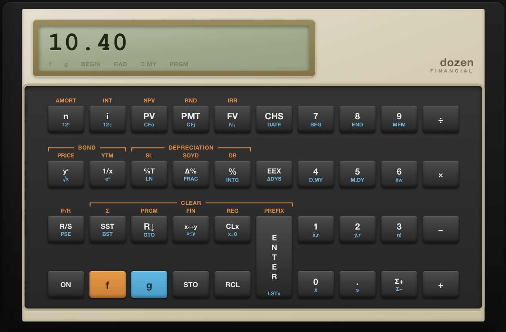

<p align="center">
  <strong>dozen</strong> &middot; RPN financial calculator library &amp; desktop app
</p>

[](https://pkg.go.dev/github.com/shanehull/dozen)
[](https://github.com/shanehull/dozen/actions/workflows/ci.yml)
[](LICENSE)



Two things in one repo:

- **`engine`** — a generic RPN calculator library: stack, registers, TVM, cash
  flows, statistics, depreciation, date math. No GUI dependency.
- **App** — a cross-platform financial calculator built with
  [Wails v3](https://v3.wails.io) on top of the engine. macOS, Windows, Linux,
  iOS, Android.

---

# Library

```bash
go get github.com/shanehull/dozen/engine
```

Two layers: pure functions for direct math, and `Engine` for stack/keystroke
behaviour that the app is built on.

## Functional API

Rates are per-period fractions (`0.05` = 5%). Inflows positive, outflows
negative. `engine.End` (ordinary annuity) or `engine.Begin` (annuity due).

```go
import "github.com/shanehull/dozen/engine"

pmt := engine.PMT(0.06/12, 360, 300000, 0, engine.End)
fmt.Printf("%.2f\n", -pmt) // 1798.65

npv := engine.NPV(0.10, -100000, 30000, 40000, 50000, 60000)
fmt.Printf("%.2f\n", npv)  // 38877.13

irr, _ := engine.IRR(-100000, 40000, 50000, 30000)
fmt.Printf("%.2f%%\n", irr*100) // 24.89%
```

### TVM

```go
FV(rate, n, pv, pmt float64, when Timing) float64
PV(rate, n, pmt, fv float64, when Timing) float64
PMT(rate, n, pv, fv float64, when Timing) float64
NPer(rate, pmt, pv, fv float64, when Timing) (float64, error)
Rate(n, pmt, pv, fv float64, when Timing) (float64, error)
```

### Cash flows

```go
NPV(rate float64, cashflows ...float64) float64
IRR(cashflows ...float64) (float64, error)
```

### Depreciation

`factorPct` = declining-balance factor as percent (200 = double-declining).

```go
DepSL(cost, salvage, life, period float64) (dep, remaining float64)
DepSOYD(cost, salvage, life, period float64) (dep, remaining float64)
DepDB(cost, salvage, life, period, factorPct float64) (dep, remaining float64)
```

## Engine

`Engine` is an RPN calculator with a four-level stack, 20 memory registers,
TVM and cash-flow slots, statistics accumulation, and program memory.

```go
c := engine.New()

c.X = 2; c.Enter(); c.X = 3
c.Add()                    // c.X == 5

c.X = 360; c.SetN()        // FinN = 360
c.X = 5; c.SetI()          // FinI = 5
c.X = -1000; c.SetPV()     // FinPV = -1000
c.SolvePMT()               // c.X == monthly payment

c.X = 4; c.Sqrt()          // c.X == 2
c.X = 180; c.Sin()         // sine of 180 degrees

c.Snapshot()               // EngineState for persistence
c.Restore(state)
```

### Methods

| Category     | Methods                                                                                        |
| ------------ | ---------------------------------------------------------------------------------------------- |
| Stack        | `Enter`, `Clx`, `Chs`, `XY`, `RollDown`, `RollUp`, `LastXRecall`                               |
| Arithmetic   | `Add`, `Sub`, `Mul`, `Div`, `YPowX`                                                            |
| TVM store    | `SetN`, `SetI`, `SetPV`, `SetPMT`, `SetFV`                                                     |
| TVM solve    | `SolveN`, `SolveI`, `SolvePV`, `SolvePMT`, `SolveFV`                                           |
| Cash flow    | `ComputeNPV`, `ComputeIRR`                                                                     |
| Amortization | `Amortize`                                                                                     |
| Bonds        | `BondPrice`, `BondYield`                                                                       |
| Depreciation | `DepreciationSL`, `DepreciationSOYD`, `DepreciationDB`                                         |
| Statistics   | `StatAdd`, `MeanX`, `MeanY`, `SDev`, `WeightedMean`, `LinEst`, `ClearStats`                    |
| Scientific   | `Sin`, `Cos`, `Tan`, `Asin`, `Acos`, `Atan`, `Ln`, `Log`, `Sqrt`, `Sqr`, `Recip`, `Pi`, `Fact` |
| Trig helpers | `ToRad`, `ToDeg`, `ToRect`, `ToPolar`, `ToHMS`, `ToH`                                          |
| Percent      | `Pct`, `PctChg`, `PctTotal`                                                                    |
| Utility      | `Abs`, `Intg`, `Frac`, `Exp`, `Exp10`                                                          |
| Date         | `DaysBetween`, `DateAdd`                                                                       |
| Memory       | `Store(n)`, `Recall(n)`                                                                        |
| Program      | `SST`, `BST`, `Goto(line)`                                                                     |
| State        | `Snapshot`, `Restore`                                                                          |
| Clear        | `ClearFin`, `ClearReg`, `ClearStats`, `ClearPgm`                                               |

### Fields

```go
c.X, c.Y, c.Z, c.T                // stack registers
c.LastX                            // last X before operation
c.Mem[0]..c.Mem[19]                // 20 general registers
c.FinN, c.FinI, c.FinPV, c.FinPMT, c.FinFV  // TVM registers
c.FinCF0, c.FinCFj, c.FinNj, c.FinCfCnt     // cash-flow registers
c.AmortN, c.AmortInt, c.AmortPrin           // amortization results
c.Flags.Begin, c.Flags.Dmy, c.Flags.Angle   // calculator mode
c.Flags.StackLift                             // stack lift flag
c.Program, c.PgmLen, c.PgmPC                 // program storage
```

## Examples

```bash
go run examples/mortgage/main.go    # $300K mortgage payment
go run examples/npv/main.go         # NPV + IRR
go run examples/fv/main.go          # future value
go run examples/stats/main.go       # statistics (engine)
go run examples/date/main.go        # date calculations (engine)
```

---

# App

A financial RPN calculator: stack, memory, TVM, cash flows, statistics,
programs. Built with [Wails v3](https://v3.wails.io).

```bash
wails3 dev
```

## Keyboard

| Key                 | Action                  |
| ------------------- | ----------------------- |
| `0`–`9`, `.`        | digits                  |
| `+` `-` `*` `/`     | `+` `−` `×` `÷`         |
| `Enter`             | `ENTER`                 |
| `Esc` / `Backspace` | `CLx`                   |
| `%`                 | `%`                     |
| `f` / `g`           | arm gold / blue shift   |
| `n` `i` `p` `m` `v` | `n` `i` `PV` `PMT` `FV` |
| `s`                 | `STO` prefix            |
| `r`                 | `RCL` prefix            |
| `x`                 | `x↔y`                   |

---

# Development

```bash
go test ./engine/           # unit + regression tests
go test -run TestUI .       # UI integration tests
go vet ./...                # lint
wails3 dev                  # app with hot reload
```

# License

MIT
